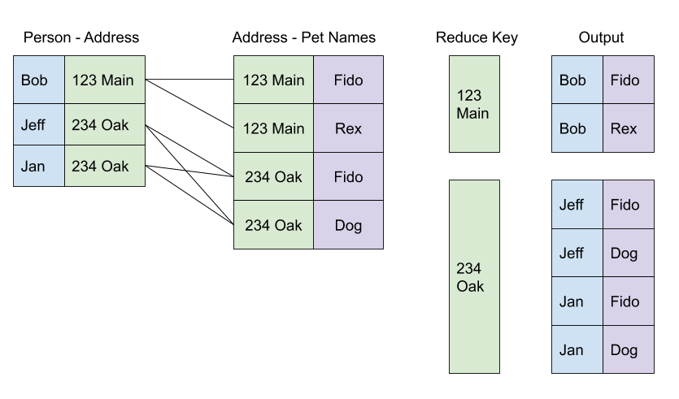
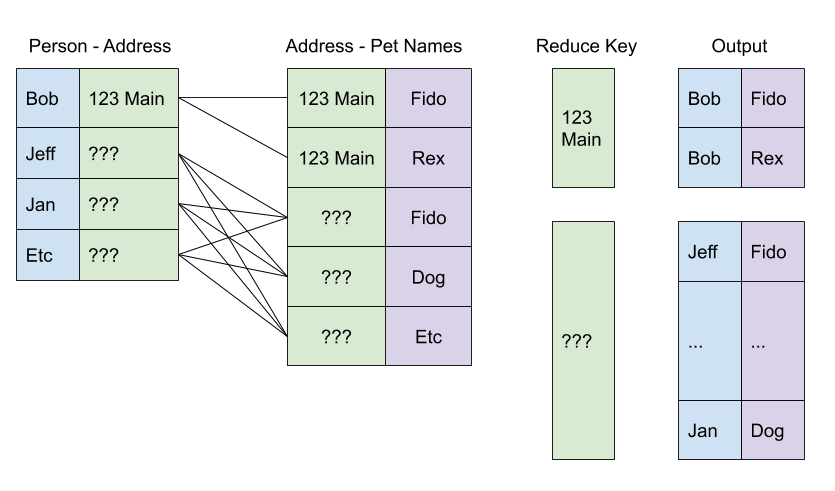
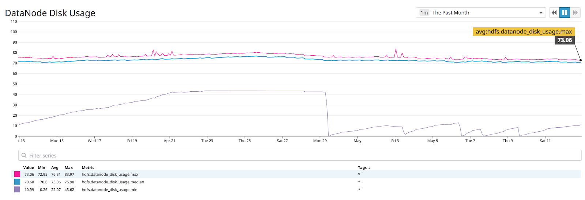
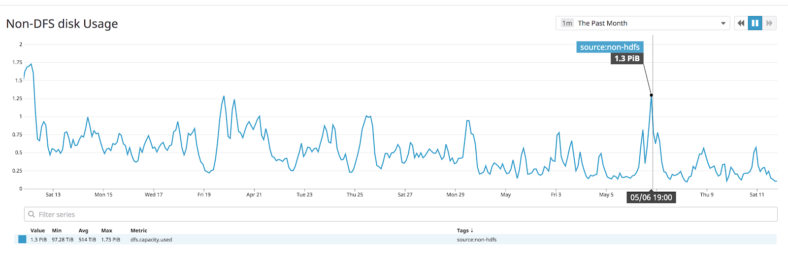
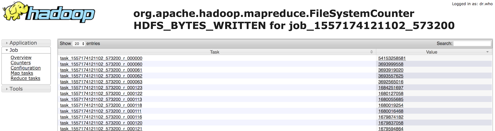
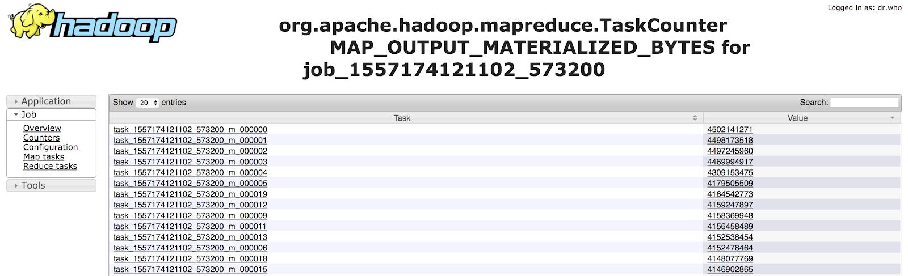

# Problem: Large Inner-Join Task Output

##Why

Inner Joins are a concept best known from databases, but are relevant to big data processing as well.  A normal big-data question would be to take a dataset of people to addresses, addresses to pets, and say “give me a file of everyone to the pets they have”.  So, something like this:



If the input data is not cleaned properly, a full expansion of the data can lead to wild output sizes.  Let’s say we forgot to clean our data, and “???” was considered a valid address:



Our output data size can quickly get out of control.  If 100,000 people have “???” addresses, and 100,000 pets are registered to address “???”, our reducer won’t have trouble reading 200,000 input records -- but it will certainly explode trying to output 10 billion records!


If this join is happening via MapReduce, this data could be written to disk via two different paths, but with similar effect:


- If the expansion is happening on a reducer, all records for “???” will be sent to a single reduce task, and the reduce task will attempt to write the 10 billion tuples.  HDFS will always write the first copy of a block to the DataNode local to the task, so if the data is bad enough, the DataNode’s storage disks will fill up entirely, crashing the DataNode (and any co-located YARN tasks).

- If the join is happening on mapper before a reducer (which is possible if you are using some flavor of map-side join or hash join), the data will end up in the NodeManager’s temp directories, not on HDFS.  Eventually, this will fail any other process using that space (generally, other jobs running on the NodeManager).


## Symptoms


The symptoms here manifest from full data directories:


- If the NodeManager’s temp directories are full, tasks from unrelated jobs will start to fail with out-of-space errors

- If the volume also contains a DataNode’s data volume, the DataNode itself can go offline.

- If widespread, HDFS free space will start to drop as well.


## Identifying and monitoring


We can approach this from two directions -- first, reactively, by finding bad cluster nodes and tracking the problem back to individual jobs, and second, by proactively watching jobs for unusual metrics.


If the data is being written by a map task in a bad job, finding it on a struggling NodeManager is easy:


```bash
root@compute-worker100 /data2/yarn/nm/usercache # du -s **/**/* | sort -h -k 1 | tail -5
1.6G        svc-om/appcache/application_1557174121102_592674
2.4G        liveramp/appcache/application_1557174121102_613906
2.8G        liveramp/appcache/application_1557174121102_613897
2.9G        svc-om/appcache/application_1557174121102_438535
3.5G        liveramp/appcache/application_1557174121102_613923
````

This shows which running applications are using the volume most heavily.


If the data is coming from a reducer, identifying the application is more of a nuisance -- it’s often easier to just look at the full list of tasks running on a NodeManager and check out the application counters.

At a global scale, we can try to watch for bad nodes by comparing max vs median DataNode storage utilization:



If we average 70% disk utilization, but a few DataNodes are > 90%, there’s likely an application misbehaving.  


Likewise, to watch for bad map output, we can globally monitor the NameNode for non-DFS disk usage (this only works if your NodeManager storage directories are on the same volumes as your DataNodes):



When approaching this from the application-monitoring side, jobs with bad joins are easy to identify via MapReduce counters.  If the data is being written directly to HDFS from a reducer, there will be a skew in the output FileSystemCounters, with the output dominated by a few tasks:




This job has a heavy, but probably not fatal, task skew.  Likewise, if the data is being written from a map task, the data will manifest as a skew in map output bytes:



This is a well-balanced job -- every mapper is sending the same amount of data to the reduce phase.


## Fixes

Fixing this problem is just a data sanitization problem -- these pathological joins never produce useful output.  Usually this just means filtering out records which map to more than a certain cardinality of other records.  Hadoop will behave better, and your data will be cleaner.  Win win :)

-----
Ben Podgursky ([GitHub](https://github.com/bpodgursky/))

