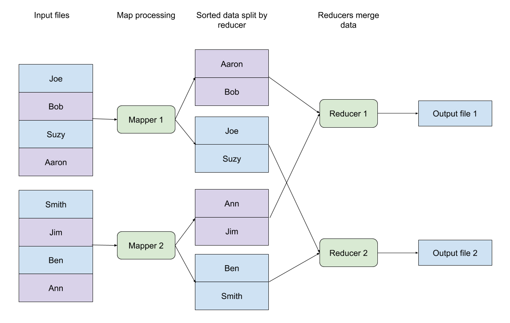
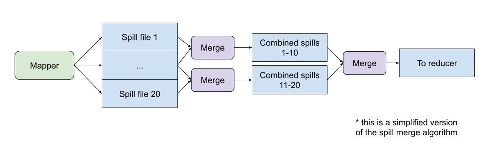
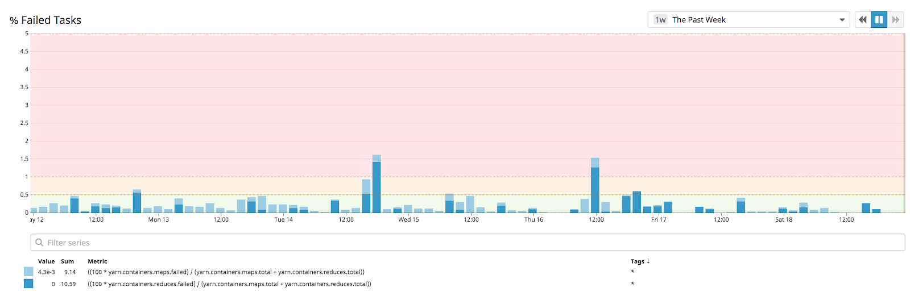
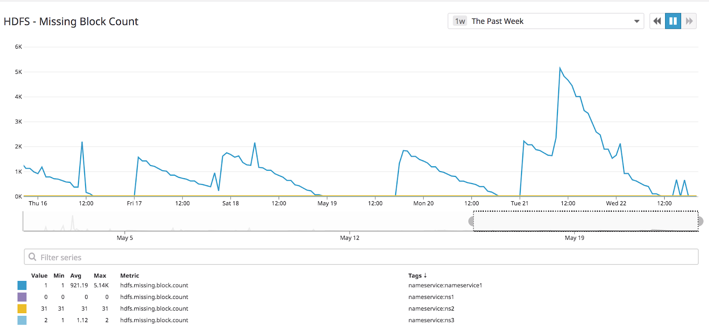
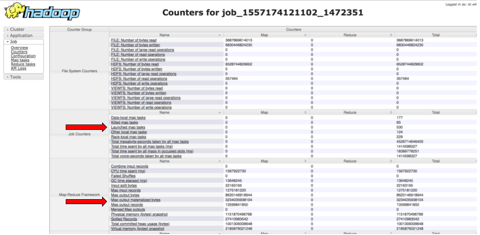

# Pathological shuffle load

## Why

All the storage and shuffle space on our on-premise Hadoop environment is backed by HDDs (spinning disks).  This is for both historical and cost-efficiency reasons; when our cluster was first set up, SSDs were prohibitively expensive.  Even today, HDDs do not perform worse than SSDs for streaming reads, which makes HDD storage a cost-effective storage option at scale.

The one situation where our Hadoop usage does call for high-IOPS operations is during map output shuffling.  A brief summary of how MapReduce sorts and transfers data from mappers to reducers:



Map tasks process their input, split the data per reduce task based on the user-supplied partitioner (usually via some kind of hash-mod), and sort the input per reducer.  

If the data size is small, this sorting all happens in memory, and the disk IO is not taxed.  However, if this output data doesn’t fit into memory -- which is often the case -- the outputs are spilled to disk.  At the end of the map task, these spill files have to be merged into a single output file:



A couple spill files is not the end of the world -- MapReduce was designed to gracefully fail to disk.  But file merges are expensive operations on spinning disks, because spinning disks absolutely hate reading from multiple files at the same time (magnets, right?)   So if a task is merging dozens of spill files, the disk will be overwhelmed with read requests.

If too many disk IOPS are dedicated to merges, at best, the job performs poorly.  At worst, the disks jump to 100% utilization:


````bash

[bpodgursky@workernode100 ~]$ sudo iostat -x 5
avg-cpu:  %user   %nice %system %iowait  %steal   %idle
           1.33    0.00    0.71   97.96    0.00    0.00
Device:         rrqm/s   wrqm/s     r/s     w/s   rsec/s   wsec/s avgrq-sz avgqu-sz   await  svctm  %util
sdb               3.40     0.00  151.70    0.20  1909.60   204.80    13.92   140.66  197.99   6.58 100.01
sdc              19.50    16.40  145.10    0.90  2046.40   138.40    14.96     4.74   32.33   6.85 100.00
sdd              31.10   790.20  119.90    4.50  1680.80  4608.00    50.55   147.76  785.35   8.04 100.00
sde               2.10     0.00  167.50    2.30  2412.00  2355.20    28.08    54.21  598.52   5.89 100.00
sdf              12.40     0.00  132.50    2.20  1728.00  2252.80    29.55   147.47  797.91   7.42 100.00
sdg              11.00   203.20  108.60    1.20  3333.60  1036.00    39.80   142.41  348.59   9.11 100.00
sdh               4.80   241.30  134.20    2.60  1560.00  2357.60    28.64   149.68  914.39   7.31 100.00
sda               0.10   476.60  143.50   27.20  3131.20  4030.40    41.95     3.00   17.59   5.81  99.22
````

As bad as this is for your jobs, it can get even worse if your HDFS DataNodes share a disk with the NodeManagers.  DataNodes check disk health on a regular cadence, and as part of this process list all files on the data volume; if this process times out, the DataNode indicates to the NameNode that the stored blocks are lost and need to be replicated.  This, in turn, leads to a burst of missing blocks and HDFS re-replication, which even further strains the worker disks.


Symptoms

Unfortunately, the symptoms of this problem often line up with the symptoms of related but different problems.  Global task failure rates may be elevated:



Missing blocks will often spike with severe disk problems:



(not pictured -- in this case, we actually could rule out disk problems as the source of missing blocks, because blocks are only missing on one of our four nameservices.  If entire volumes were locked, we would expect all nameservices to be missing blocks).

##Identifying and monitoring

Like usual, there are two main approaches to debugging this issue: reactive and proactive.

Reactive debugging here boils down to a simple process:


- Figure out which disks are experiencing heavy load
- Figure out which processes are writing to those disks
- Trace these errors back to specific jobs


This is a highly simplified example (we have scripted this process), but we can walk through how to debug this from scratch:

First, iostat is a useful utility for checking disk read/write throughput and utilization.  We can check the status of every disk at a moment in time:

```bash
[bpodgursky@somenode ~]$ iostat -x 5
avg-cpu:  %user   %nice %system %iowait  %steal   %idle
          61.63    0.00    2.69    9.98    0.00   25.70
Device:         rrqm/s   wrqm/s     r/s     w/s   rsec/s   wsec/s avgrq-sz avgqu-sz   await r_await w_await  svctm  %util
sda               0.00     6.60    0.00    2.20     0.00    70.40    32.00     0.00    0.00    0.00    0.00   0.00   0.00
sdc               0.80  4011.20   69.60   82.00 25600.00 32745.60   384.87     1.35    8.88   11.17    6.93   1.22  18.54
sdd               0.60   102.20  140.80    3.20 14944.00   843.20   109.63     2.00   13.95   14.09    7.94   6.81  98.00
sde               0.40     4.60  160.00    0.80 23763.20    43.20   148.05     4.16   25.74   25.87    0.00   6.22 100.00
sdf               0.40     6.80   38.80    0.80 10129.60    60.80   257.33     0.13    3.32    3.28    5.50   1.23   4.88
sdg               1.80 16819.00   89.20  270.60 15104.00 138059.20   425.69   148.77  362.06   59.68  461.74   2.78  99.98
sdh               0.60     4.80  155.20    0.80 15024.00    44.80    96.59     5.05   31.86   32.02    0.00   6.41  99.94
sdi               3.00    24.00  123.20    1.00 52878.40   200.00   427.36     1.38   11.13   11.20    1.80   1.75  21.68
sdj               0.40  8811.00   24.20  124.20  6822.40 55656.00   421.01    28.11  169.17   20.51  198.13   1.63  24.20
sdk               3.00     5.80  107.00    0.60  6894.40    51.20    64.55     2.58   23.99   24.13    0.00   9.29 100.00
sdl               2.00     4.80  137.00    1.20 19027.20    48.00   138.03     5.76   42.93   43.25    5.67   7.24 100.00
sdm               0.40    97.00  119.60    2.60 52806.40   796.80   438.65     4.16   34.05   33.40   63.92   3.82  46.68
sdb               2.00   100.40  151.80    3.80 14489.60   833.60    98.48     1.66   10.63   10.89    0.37   6.35  98.78
```

Let's pretend sdg was in bad shape, and we want to figure out why.  We want to trace sdg back to a mounted drive, which we can do through df:

```bash
[bpodgursky@somenode ~]$ df -h
Filesystem            Size  Used Avail Use% Mounted on
/dev/sda2             550G   16G  506G   3% /
tmpfs                  63G     0   63G   0% /dev/shm
/dev/sda1             239M   72M  155M  32% /boot
/dev/sdb1             3.6T  2.4T  1.3T  66% /data1
/dev/sdc1             3.6T  2.4T  1.3T  65% /data2
/dev/sdd1             3.6T  2.4T  1.3T  67% /data3
/dev/sde1             3.6T  2.4T  1.3T  66% /data4
/dev/sdf1             3.6T  2.4T  1.3T  65% /data5
/dev/sdg1             3.6T  2.4T  1.3T  67% /data6
/dev/sdh1             3.6T  2.4T  1.3T  65% /data7
/dev/sdi1             3.6T  2.4T  1.3T  66% /data8
/dev/sdj1             3.6T  2.4T  1.3T  66% /data9
/dev/sdk1             3.6T  2.4T  1.3T  66% /data10
/dev/sdl1             3.6T  2.4T  1.3T  65% /data11
/dev/sdm1             3.6T  2.5T  1.2T  68% /data12
```

So we want to figure out what is writing to /data6.  Luckily, we have a simple tool for this: lsof.  If we're convinced the problem is spills, we can make things simple by just searching for spill files:

```bash
[bpodgursky@somenode ~]$ sudo lsof | grep data6 | grep spill | awk '{print $9}'
/data6/yarn/nm/usercache/liveramp/appcache/application_1557174121102_1472351/attempt_1557174121102_1472351_m_000077_0_spill_37.out
/data6/yarn/nm/usercache/liveramp/appcache/application_1557174121102_1472351/attempt_1557174121102_1472351_m_000077_0_spill_49.out
/data6/yarn/nm/usercache/liveramp/appcache/application_1557174121102_1472351/attempt_1557174121102_1472351_m_000077_0_spill_13.out
/data6/yarn/nm/usercache/liveramp/appcache/application_1557174121102_1472351/attempt_1557174121102_1472351_m_000077_0_spill_1.out
/data6/yarn/nm/usercache/liveramp/appcache/application_1557174121102_1472351/attempt_1557174121102_1472351_m_000077_0_spill_61.out
/data6/yarn/nm/usercache/liveramp/appcache/application_1557174121102_1472351/attempt_1557174121102_1472351_m_000077_0_spill_73.out
/data6/yarn/nm/usercache/liveramp/appcache/application_1557174121102_1472351/attempt_1557174121102_1472351_m_000077_0_spill_25.out
/data6/yarn/nm/usercache/liveramp/appcache/application_1557174121102_1472351/attempt_1557174121102_1472351_m_000077_0_spill_85.out
/data6/yarn/nm/usercache/liveramp/appcache/application_1557174121102_1472418/attempt_1557174121102_1472418_m_000134_0_spill_11.out
/data6/yarn/nm/usercache/liveramp/appcache/application_1557174121102_1472418/attempt_1557174121102_1472418_m_000134_0_spill_23.out
/data6/yarn/nm/usercache/liveramp/appcache/application_1557174121102_1472418/attempt_1557174121102_1472418_m_000134_0_spill_35.out
/data6/yarn/nm/usercache/liveramp/appcache/application_1557174121102_1472418/attempt_1557174121102_1472418_m_000134_0_spill_47.out
```

These of course map back to specific mapreduce jobs; if we see an unusual number of spill files for a single job (for example, job 1472351 has 9) we may want to kill and rewrite this job.

Of course, we’d prefer not to wait for performance to drop before debugging this issue.  Like usual, we can identify bad jobs from their MapReduce counters.   Here, we care about materialized map output bytes vs the total launched maps:



Fetched programmatically, these correspond to:

- org.apache.hadoop.mapreduce.TaskCounter.MAP_OUTPUT_MATERIALIZED_BYTES
- org.apache.hadoop.mapreduce.JobCounter.TOTAL_LAUNCHED_MAPS

At LiveRamp we track these counters for every job and alert if MAP_OUTPUT_MATERIALIZED_BYTES/TOTAL_LAUNCHED_MAPS is over 10GB; this is the rough threshold where we start seeing issues on our HDDs.

##Fixes


The simple fix without an infrastructure change here is straightforward; reduce the data written from each map task.  The implementation here is the exact opposite of the fix for the small files problem earlier -- have more tasks which read less data each.


If you have the opportunity to redesign your infrastructure environment (either physically or virtually), the easiest fixes are to:

- Use separate volumes for map output and HDFS.  This way, drives impacted by task writes do not impact HDFS DataNodes

- Use SSDs instead of HDDs as a temporary map output volume.  Since map output will still be relatively tiny compared to HDFS storage, these drives can be fairly small and cost-effective.

Of course, if possible, the best fix an application redesign which simply outputs less data -- for example, by using [combiners](https://data-flair.training/blogs/hadoop-combiner-tutorial/) or compressing map output using a fast codec like LZO or ZSTD.

----
Ben Podgursky ([GitHub](https://github.com/bpodgursky/))

