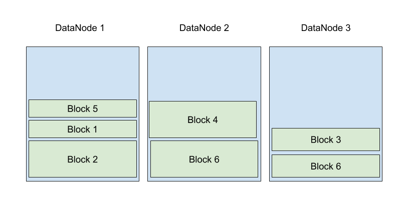
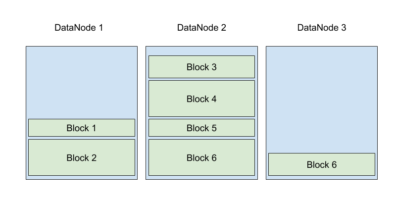
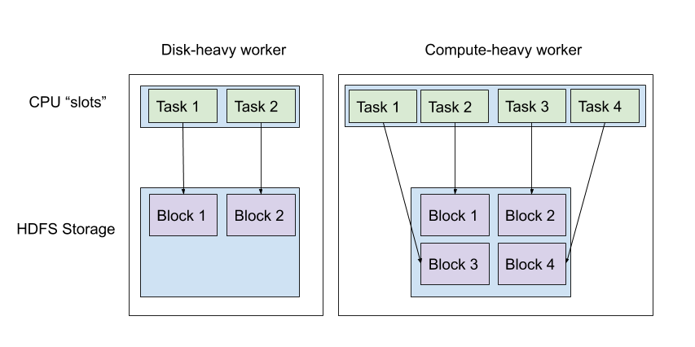
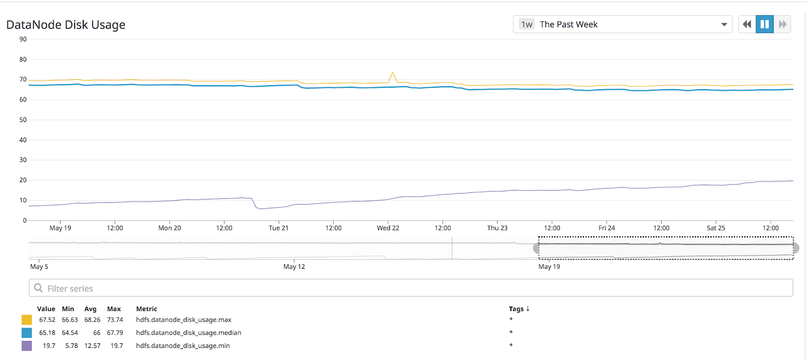

# Problem: Poor HDFS Balancing

## Why

HDFS spreads stored data across the DataNodes in an HDFS cluster.  In an ideal world, DataNodes would evenly share the burden of HDFS storage, and blocks (and thus files) would be evenly spread across storage volumes, to balance HDFS reads and writes:

In practice -- storage drift happens, even on identical hardware.  Some jobs will write large amounts of data to particular nodes; nodes will have downtime for hardware maintenance and come back up with empty drives.  Over time, some DataNodes will end up with full disks, while others will sit empty:

Imbalanced data inevitably causes performance degradation for both HDFS and cluster jobs:

- MapReduce tries to run node-local tasks; if all the data is in one place, this isn't possible.
- If a subset of DataNodes hold all of the data, they are responsible for serving all the data; ideally, network IO would be split evenly across nodes.

To make matters worse, our hardware configurations ended up exacerbating the problem even further:  

While Hadoop bills itself as built to run on heterogeneous hardware, Hadoop in truth is far easier to maintain at scale on homogeneous hardware.  Unfortunately, finance teams rarely endorse replacing working hardware "because we want all the machines to be new".  So any Hadoop cluster at scale will end up running a mix of old and new machines.  

Our cluster is 10 years old, and is no exception.  When we began [our migration to GCP](https://liveramp.com/engineering/migrating-a-big-data-environment-to-the-cloud-part-2/) (and stopped investing in new hardware), we ran four generations of servers, each with different CPU:RAM:disk ratios:

- 32CPU, 64GB RAM, 24TB HDD
- 32CPU, 128GB RAM, 48TB HDD
- 40CPU, 128GB RAM, 48TB HDD
- 72CPU, 256GB RAM, 48TB HDD

Memory to CPU ratios matter for job processing, but poor HDFS balance is actually driven by the CPU to disk ratio.  When a task on a node writes to HDFS, it (naturally) writes the first block to the local DataNode; this minimizes write latency.  From there, HDFS replaces the blocks first to another node in the rack, and last to a node on a different rack.  

Unfortunately, this means that nodes with more worker slots absorb a larger fraction of new HDFS files than the smaller nodes:

If left unchecked, disks will fill up entirely, causing chaos for both HDFS and any Hadoop jobs running on the node.

Luckily, HDFS has a tool to fix this -- the Balancer.  The HDFS Balancer is a tool which does what it says -- it moves blocks from full DataNodes onto empty DataNodes.  I won’t go into details, but it is easy to run either through [Cloudera Manager](https://www.cloudera.com/documentation/enterprise/5-12-x/topics/admin_hdfs_balancer.html) or [raw Hadoop](https://hadoop.apache.org/docs/r2.7.2/hadoop-project-dist/hadoop-hdfs/HDFSCommands.html#balancer).

While the Balancer did not work for us at scale out of the box, with some tuning we got our HDFS balance problems under control.  I’ll describe how we figured out our balancer wasn’t really working, and what we changed to get it working quickly enough.

## Symptoms and Monitoring

The symptoms of bad balancing are straightforward -- tasks fail because disks are full; DataNodes exclude directories for writes because the disks are full.  

The NameNode web UI has enough information to give a high-level view of HDFS health.  As far as balancing is concerned, the main metric are the DataNode usage percentages:

At LiveRamp we put a high value on time-series monitoring (we always want to be able to identify when something went wrong.  So we push all our monitoring metrics to DataDog:

If highest-usage DataNodes are way above average, it may be a sign that HDFS is imbalanced.

## Fixes

The first line of attack is to update the balancer to balance far, far more aggressively than the default settings allow.  The default balancer settings work well on a cluster of a few dozen nodes, but with a few hundred nodes, the balancer cannot keep up.  Some of the interesting custom balancer properties are:

- **dfs.balancer.[moverThreads,dispatcherThreads]**: These should be increased as necessary with cluster scale (we use 1000+)
dfs.datanode.balance.max.concurrent.moves: Should be scoped up with hardware capacity (a machine with 12 drives can handle more than a machine with 2)
- **dfs.datanode.balance.bandwidthPerSec**: Likewise, should be scoped up with network availability per node
- **Balancer heap size**: Set as necessary (we use 3GB)
- **Disabled logging**: This is a stupid problem, but the Balancer logs noisily and pointlessly, sometimes to the point of filling up disks.  Either sweep the drive regularly or disable INFO logging.
- **Rebalancing policy**: Because we run a federated HDFS, we use the BlockPool strategy instead of the DataNode policy.  This makes HDFS balance the sizes of specific block pools across DataNodes, instead of aggregate storage size.

We also restart our balancer at midnight, whether the last run has finished or not.  If particular DataNodes are performing poorly, the balancer can get into iterations where it is not transferring very much data.  Restarts are totally safe.

Last but not least -- if even heavily-modified balancing cannot balance HDFS, consider whether all of your machines even need to run DataNodes.  In the age of fast networking, data locality is increasingly irrelevant for quick data processing.  We actually ended up disabling DataNodes entirely on oldest hardware, so we could use the perfectly-functional CPUs and work around the ageing disks.

----
Ben Podgursky ([GitHub](https://github.com/bpodgursky/))

