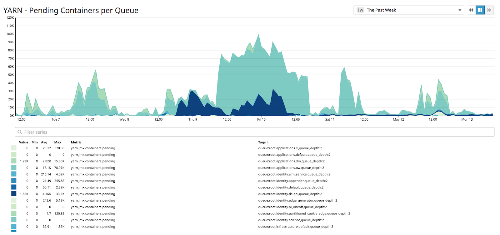
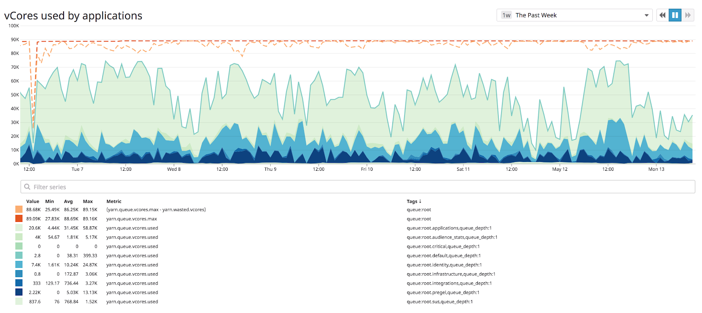
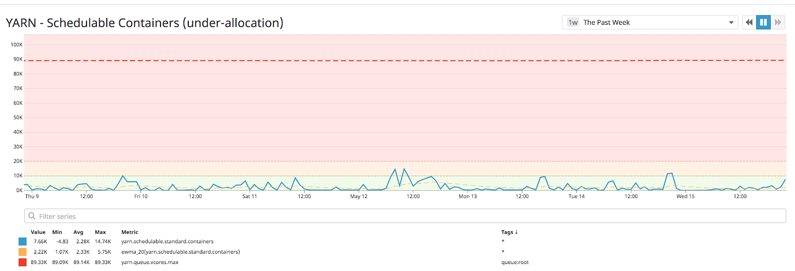
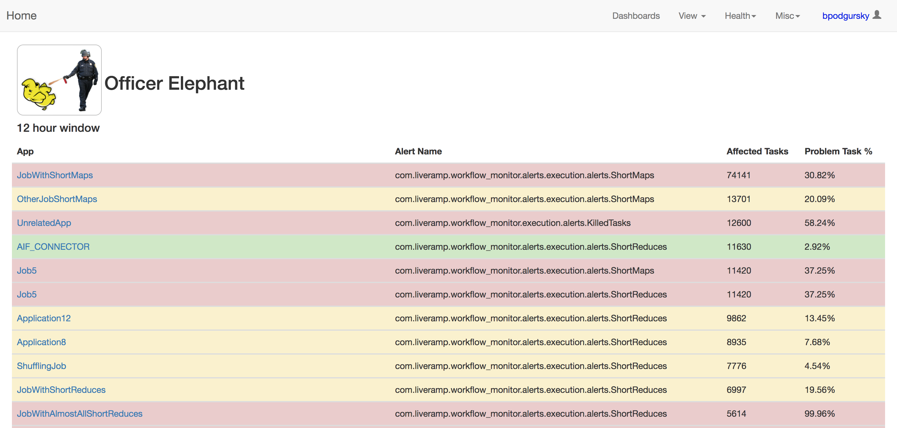
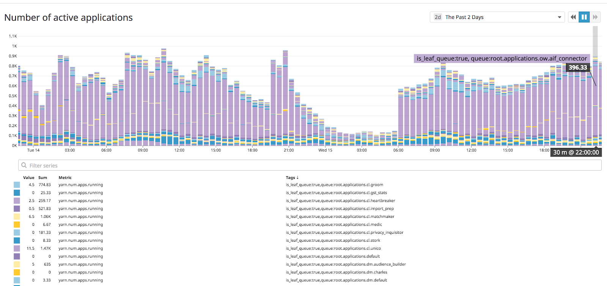
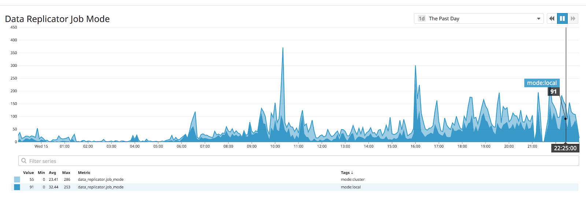

# Problem: ResourceManager Slow Scheduling
  
Preface:  We expect that in the future (or maybe even now), [YARN Federation](https://issues.apache.org/jira/browse/YARN-5597) will address this problem.  We have not been in a position to test out this feature, but we would love to hear your experiences with federated ResourceManagers.

## Why

The ResourceManager is usually not the bottleneck of a Hadoop cluster, but as a single-threaded process, the [FairScheduler](https://hadoop.apache.org/docs/current/hadoop-yarn/hadoop-yarn-site/FairScheduler.html) is only able to allocate free NodeManager resources at a finite rate.


The FairScheduler works by finding unused capacity on the cluster, and then determining which running job is most deserving of those resources.  It does this by sorting child queues by “fairness”, granting resources to the top child, and then recursively doing the same for that queue’s children, until the resources are assigned directly to a running application.  Without diving into the source code too deeply, you can see the important code in FSParentQueue.java:


```java
  @Override
  public Resource assignContainer(FSSchedulerNode node) {
    
  Resource assigned = Resources.none();
    // If this queue is over its limit, reject
    if (!assignContainerPreCheck(node)) {
      return assigned;

    }

    Collections.sort(childQueues, policy.getComparator());

    for (FSQueue child : childQueues) {
      assigned = child.assignContainer(node);
      if (!Resources.equals(assigned, Resources.none())) {
        break;
      }
    }

    return assigned;
  }

```

Unfortunately, this code was written to be generic, not to be high-performance.  If tasks are launched quickly enough, and the cluster has enough running applications, the ResourceManager will be unable to run through this recursive assignment frequently enough to allocate all spare resources.

## Symptoms

When this allocation speed is your bottleneck, your cluster will have a long backlog of pending containers:



as pulled from the ResourceManager’s JMX metrics (http://my-rm:port/ws/v1/cluster/metrics).  But the total VCore and Memory usage will be lower than the total available capacity :



as pulled from the scheduler’s API (http://my-rm:port/ws/v1/cluster/scheduler).  (these graphs are not meant to indicate problem, just how we track the problem).


You can see if the FairScheduler processing is dominated by this sort by jstack-ing the ResourceManager process and looking for the “ResourceManager Event Processor” thread:


```bash

"ResourceManager Event Processor" #30 prio=5 os_prio=0 tid=0x00007ff4e5485000 nid=0xb999 runnable [0x00007fce7fbe7000]
   java.lang.Thread.State: RUNNABLE
        at org.apache.hadoop.yarn.server.resourcemanager.scheduler.fair.FSLeafQueue.getResourceUsage(FSLeafQueue.java:244)
        at org.apache.hadoop.yarn.server.resourcemanager.scheduler.fair.FSParentQueue.getResourceUsage(FSParentQueue.java:98)
        at org.apache.hadoop.yarn.server.resourcemanager.scheduler.fair.FSParentQueue.getResourceUsage(FSParentQueue.java:98)
        at org.apache.hadoop.yarn.server.resourcemanager.scheduler.fair.FSParentQueue.getResourceUsage(FSParentQueue.java:98)
        at org.apache.hadoop.yarn.server.resourcemanager.scheduler.fair.FSQueue.assignContainerPreCheck(FSQueue.java:260)
        at org.apache.hadoop.yarn.server.resourcemanager.scheduler.fair.FSParentQueue.assignContainer(FSParentQueue.java:167)
        at org.apache.hadoop.yarn.server.resourcemanager.scheduler.fair.FairScheduler.attemptScheduling(FairScheduler.java:1067)

```

If you are always blocked by this container assignment, this may be your problem.

## Identifying and monitoring

We identify whether we are hitting ResoureManager throughput limits by showing when we have both:

- Spare cluster capacity
- A backlog of tasks to run

We graph and monitor this metric in DataDog as “under-allocation”:



This identifies that the problem is happening.   To identify which applications are causing the problem, we track two things:

- Applications with short tasks
- Queues with large numbers of running jobs

There are a couple ways to track short tasks in a MapReduce job.  The simplest way is to just pull it out of the counters:

- org.apache.hadoop.mapreduce.JobCounter/VCORES_MILLIS_MAPS
- org.apache.hadoop.mapreduce.JobCounter/VCORES_MILLIS_REDUCES


Each give (assuming a single allocated CPU) the wall-clock time spent by map tasks and reduce tasks.  Combining this with:

- org.apache.hadoop.mapreduce.JobCounter/TOTAL_LAUNCHED_MAPS
- org.apache.hadoop.mapreduce.JobCounter/TOTAL_LAUNCHED_REDUCES

We can just divide these out to get the average wall-clock task time per job.


Tracking these stats per job is a nuisance, and poorly-performing jobs can fall through the cracks.  Since we collect all application counters to a central database, we were able to put together a “wall of shame” dashboard, to quickly identify problem applications:



This way, when we notice cluster performance issues, we just have to check what looks bad on Officer Elephant.

Monitoring concurrent active applications is easy: we pull it out of the scheduler API and track concurrent active applications per queue:



We use 1,000 concurrent jobs as an alert threshold -- your mileage may vary with different task request patterns and “hardware”.

## Fixes

Not surprisingly, there are two knobs we can turn to eliminate this problem.  We can reduce one or both of:

- The rate at which tasks are requested
- The number of running jobs + queues

Reducing the rate at which tasks are requested is “easy”: batch maps into fewer, larger, map tasks, and tune your jobs to have fewer reduces.  Luckily, we already have solutions here -- they are identical to the solution to the “small files” [problem](small_files.md) -- see that section for details


Tuning the number of running jobs per queue is trickier.  If only a couple applications are abusing the scheduler, it’s practical to talk to those teams and ask them to run fewer concurrent jobs.  For us, this became a more widespread problem, and we implemented a pre-scheduler FIFO submission queue (the “RMJMXFlowSubmissionController”).  The basic idea is:


- A FIFO ZooKeeper queue sits in front of each scheduler queue
- Jobs check out the ZK queue before submitting themselves to the RM; if more than X 150 concurrent jobs are running in a queue, block before submission
- If you are still not scheduled after 12 hours (configurable), run anyway (to avoid starvation)

Last but not least: the best way to reduce the number of running jobs is to ask yourselves “does this really need to run on the cluster”.  There is a high overhead cost to running a YARN application just to transform 50mb of data; instead of submitting to the RM, launching an AM and a worker task, you can use the same API but process the data locally with Hadoop local mode.


We have shifted several of our high-cadence applications to Hadoop local mode for small input sizes: use production YARN when input data is > 1GB, but otherwise work within the client process.  As you can see here, one of the jobs we run most frequently, the Data Replicator, runs 75% in local mode and only 25% against production YARN:



----

Ben Podgursky ([GitHub](https://github.com/bpodgursky/))


