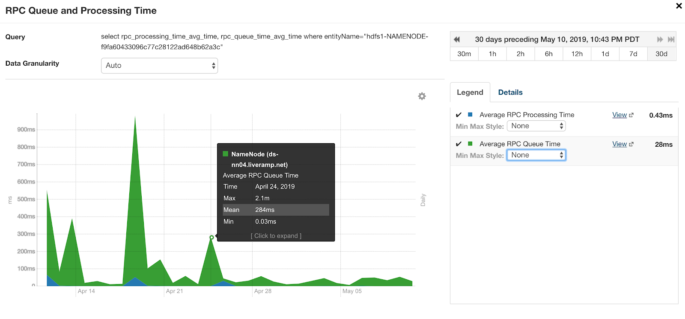
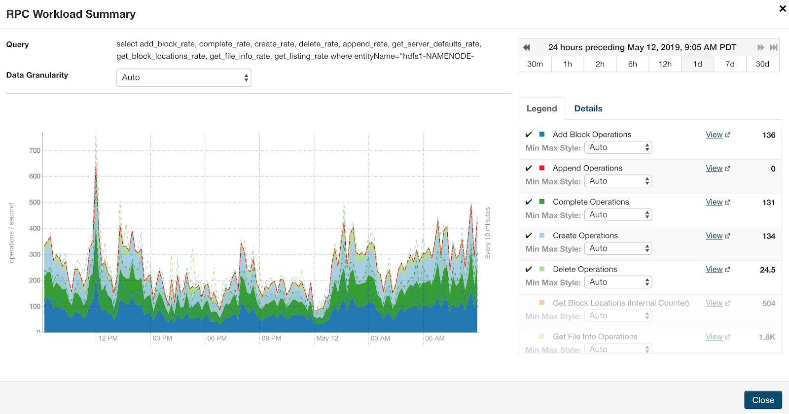
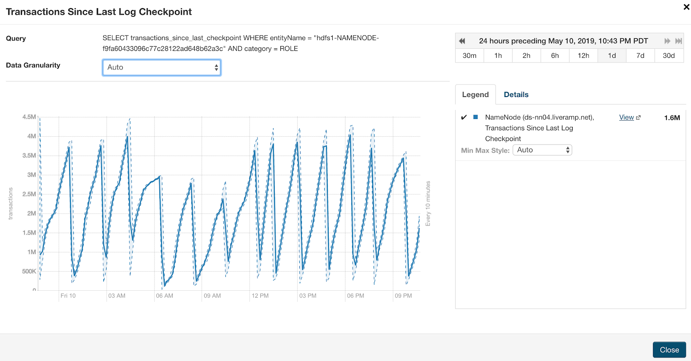
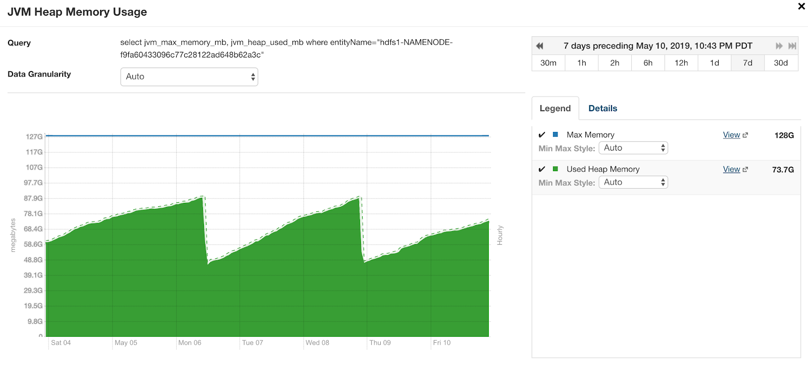
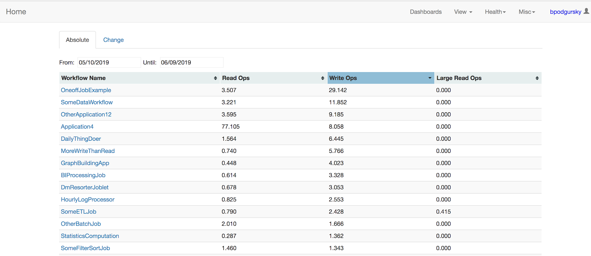
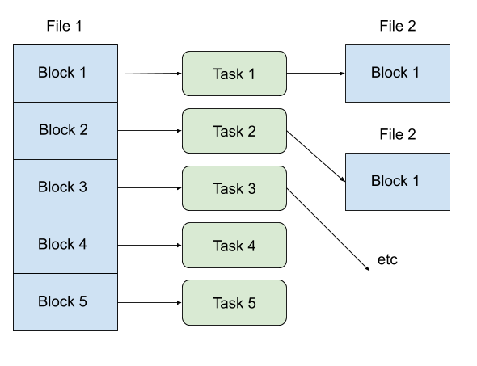
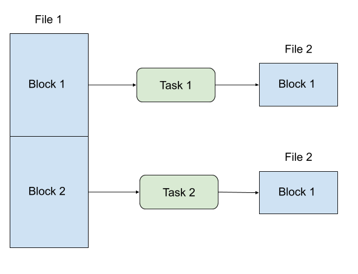
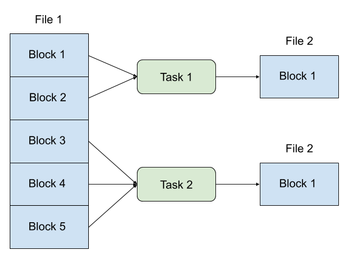
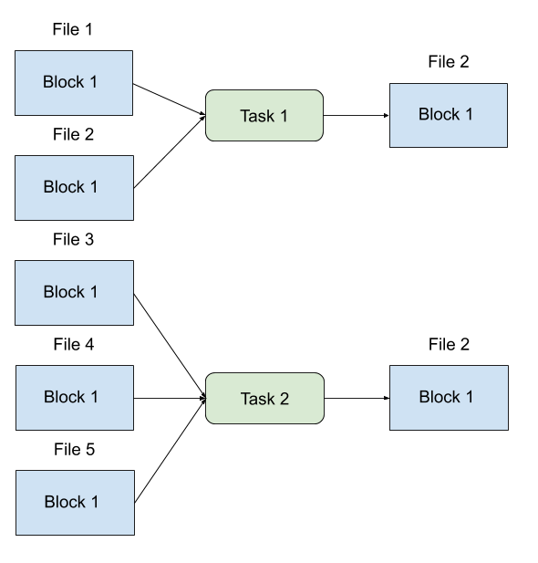
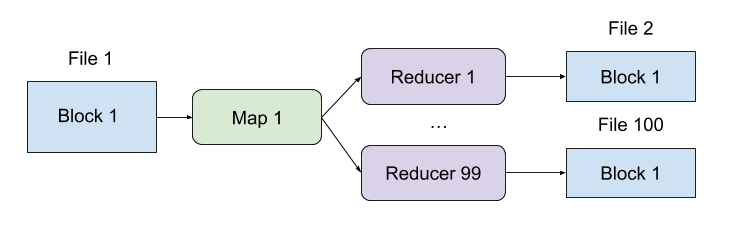

# Problem: Small Files

## Why

A hundred articles have been written about the HDFS [small files problem](https://blog.cloudera.com/blog/2009/02/the-small-files-problem/), so I won’t spend too much time describing why it is a problem.  The short story -- HDFS does not perform well if you have a huge number of files:

- The NameNode has to hold all files and blocks in memory.  Giant Java heap sizes mean expensive garbage collection and unreasonable machine sizes.

- Another problem with small files isn’t that they just exist in memory -- it’s that users of HDFS now have to make more RPC calls just to read them.  So now instead of making 1 NameNode call to read 1 large file, clients have to make 10 NameNode call to open 10 small files, 10xing the NN RPC call volume.
 
## Symptoms

The general user complaints when the NameNodes are overloaded with small files will be “everything is just kinda slow”:

- Tasks take a long time to start processing data, but read data at a normal speed once the file is open
- HDFS command line queries hang or time out
- The NameNode UI is unresponsive 

If you are using Cloudera Manager, you can find trends in RPC Processing time and RPC Queue time.  You can also pull these directly from the [NameNode JMX metrics](https://cwiki.apache.org/confluence/display/EAG/Hadoop+JMX+Monitoring+and+Alerting#HadoopJMXMonitoringandAlerting-NameNodeMetrics).  “Badness” here is a subjective measure -- it’s often easiest to just identify the point at which things “got bad”, and figure out what changed.  But < 100ms in “RPC Queue Time” is a decent target:



If too many files are being created (as opposed to just sitting in NameNode memory), you can recognize this on the RPC Query graphs:        



(note:  remember to look RPC volume on the active NameNode, not the standby)

Another indirect signal that an unusual number of files are being created or deleted is the NameNode transactions graph.  NameNodes are configured to transfer checkpoint images from the standby NameNode after either a certain window of time or a certain number of transactions.  For us, this is always dictated by the number of transactions; if we see that images are being transferred every 20 minutes, we check to see why we have such a high edit volume:



Last but not least is just the NameNode garbage collection graphs.  At the end of the day, a NameNode is just another Java process, and if it is spending most of its time in GC, or running full GCs every few minutes, something is Very Wrong.  This is available in Cloudera Manager, but you could use any other Java profiling tool to the same effect:



## Identifying and Monitoring

On a cluster which only runs a handful of unique applications, identifying which applications are creating too many files isn’t difficult.  If there are hundreds of unique applications though, the debugging needs to be a bit more organized.

There are two related questions we need to ask: (1) what is creating all these files right now? (2) HDFS has 100,000,000 files; who owns them all?

The quickest way to answer the first question is to dive straight into the HDFS audit logs.  HDFS can be configured to log all metadata operations to disk; for us, these live in /var/log/hadoop-hdfs/hdfs-audit.log.  For a reasonably active cluster, these are too large to store on disk for more than a day or two (without backing them up to HDFS or the like), but they are still useful for debugging in real-time.  If we just want to ask “which directories have had the most files created in a particular time window”, we can do that with a bit of bash:

```bash
root@my-namenode /var/log/hadoop-hdfs # cat hdfs-audit.log | grep "cmd=create" | awk -F $'\t' '{print $5}' | awk -F/ '{print "/"$2"/"$3"/"$4"/"}' | sort | uniq -c | sort -n | tail -10
     32 /user/spark/applicationHistory/
     53 /data/tmp/some_serrvice/
     67 /data/some_application/workspace/
     70 /data/tmp/other_team_app/
     76 /data/example/imports/
    100 /data/tmp/custom_application/
   1353 /tmp/logs/svc-team1/
   9216 /tmp/logs/example_user/
  12722 /tmp/logs/svc-team2/
  17509 /data/team3/tmp/
```

This command:

- Dumps the audit logs and filters for creation commands
- Prints the path of the created file
- Truncates the path to /three/levels/deep
- Counts per directory
- Sorts by count and shows on the top 10

So if this nameservice was unhealthy, we’d be taking a close look at who is writing to /data/team3/tmp/


This works well when hot-fixing a nameservice, but path-based monitoring often leaves gaps if you don’t have a firm mapping from directory to application.  We actually more frequently monitor from the other direction -- identifying files created per application.  Hadoop counters come to the rescue here.  We store the MapReduce counters for every application we run.  The ones we care about when debugging NameNode load are recorded in the org.apache.hadoop.mapreduce.FileSystemCounter enum, as


- HDFS_WRITE_OPS: files created by HDFS
- HDFS_READ_OPS: files read on HDFS

We aggregate these counters across all instances of a business-level application to get a nifty breakdown of “who is creating the most files”:



On the other hand, if your concern isn’t the rapid file creation, but instead an accumulation of historical small files, hdfs -count is always the quickest tool:


```bash
[bpodgursky@gateway01 ~]$ hdfs dfs -count /data/team1/tmp/
     1485269      6512953    183338924535561 /data/team1/tmp
```

This tells us we have 1.4mm directories, 6.5mm files, and 183TB of data in the /data/team1/tmp tree.  Whether that is a reasonable amount of data is a business-level question.  But what we can say is that files average 28,149,892 bytes each.  This isn’t catastrophic, but it’s a bit small-- if this nameservice had an excess of files, we’d ask this team to improve their task batching (described more below).


## Fixing

So, what tools do we have to reduce our file count?  One key thing to note here is, we can never produce fewer files than we have tasks.  Fundamentally, two mappers or reduces can never write to the same HDFS file, so to consolidate output files, we also have to consolidate input files.


FileInputFormat will default to launching one map task per block.  This means that if even if you come into your job with nicely batched files, if your block size is small, you’ll end up with a bunch of block-sized files anyway:



Not great!  This is especially bad if your tasks are filtering data from the input; if your blocks start at 64mb, and each task only outputs 16mb, all of a sudden you have a bunch of 16mb files.


The easiest fix of course, is to increase your block size.  The default 64mb is pretty tiny, and we find 400-500mb block sizes easy to work with.  Larger input blocks give larger output files:



The downside to larger blocks is slow tasks.  Jobs can only parallelize to the count of blocks, so if your 1TB file only has 2 blocks, your 2 map tasks will take forever.   You can give yourself flexibility by manipulating your InputFormat’s split size, so tasks read multiple blocks at a time:



This still breaks down if your input is a bunch of single-block files.  You can fix this though, by taking advantage of Hadoop’s [CombineFileInputFormat](https://hadoop.apache.org/docs/r2.7.4/api/org/apache/hadoop/mapred/lib/CombineFileInputFormat.html) to read multiple files per task:



Another common problem with MapReduce jobs is that the reducer count is not set proportionately to input size.  If a job is using 100 reduce tasks, it will produce 100 output files, even if the input is tiny:



Different jobs have different expansion factors, but the general approach here is to make the count of reducers some function of input size:


```
  public static Map<Object, Object> estimateReduces(Path input, long bytesPerReduce) throws IOException {
    FileSystem fs = input.getFileSystem(new Configuration());
    long length = fs.getContentSummary(input).getLength();
    long reducers = Math.max(1, length / bytesPerReduce);
    return Collections.singletonMap("mapreduce.job.reduces", reducers);
  }

```

The really extreme solution we have implemented at LiveRamp is to actually index into a block, maintaining a separate metadata file with logical data boundaries.  This allows tasks to write multiple “blocks” without incurring extra NameNode operations -- because the NameNode doesn’t know they exist.  These constructs, which we call “Virtual Partitions”, is out of the scope of this article though.

-----
Ben Podgursky ([GitHub](https://github.com/bpodgursky/))


