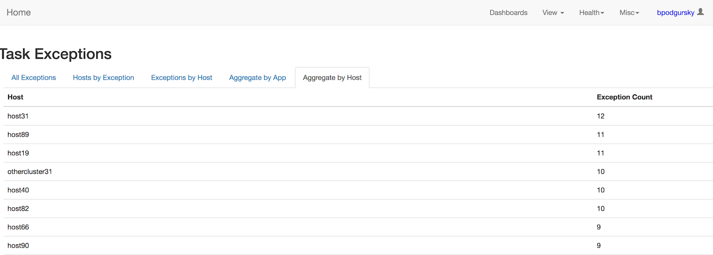
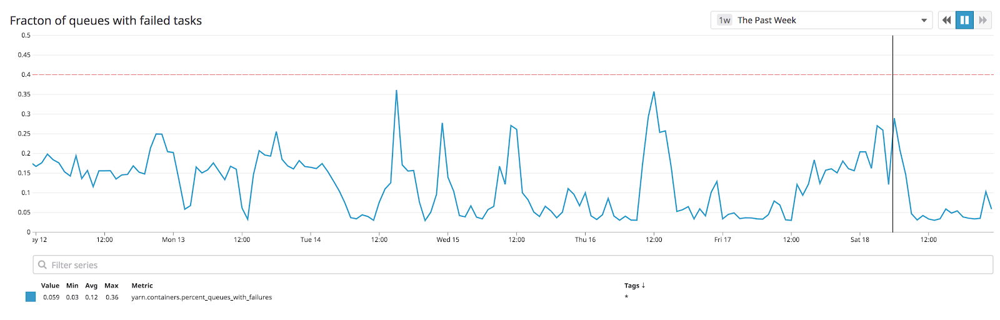

# Bad Hardware

Identifying and fixing bad hardware sounds like it should be the easy part of data processing (just replace it!), but at scale, is challenging.

Hadoop does a decent job of blacklisting nodes or disks which have completely failed. However, if node is failing tasks at an elevated but not catastrophic rate, the errors might go unnoticed for quite some time since Hadoop has several layers of error retries built in (HDFS clients will fail over to another DataNode; MapReduce tasks will retry on new workers).  

Just because jobs eventually succeed doesn’t mean everything is fine.  In an ideal world, a job with 100 tasks will launch every task at once.  However, if 1% of tasks fail randomly on the first attempt, we double the job’s expected runtime.

## Symptoms

Symptoms of bad hardware run the gamut from “everything is failing” to “this job is kinda slow”.  Outright failures are obvious.  More insidious signs are when a large fraction of jobs quickly reach 99% done, but hang on one or two remaining tasks.

## Why

There’s no magic fix to bad hardware.  Sometimes drives just perform really poorly before they die.  Sometimes the RAID controller just sucks.  Sometimes the fans don’t work.  Sometimes the air conditioner is broken and one rack of workers is running hot.

Stated succinctly by Tolstoy in Anna Karenina:

"Happy Hadoop nodes are all alike; every unhappy Hadoop node is unhappy in its own way."

## Identifying and monitoring

In an ideal world, standardized performance benchmarks run across your environment to make sure all hardware is performing roughly equally.  In practice, this is difficult; machines might perform badly not because of hardware errors, but because a CPU intensive application happens to be running concurrently.  

We end up primarily relying on passive metrics more than active testing.  Every time a job finishes, we sample the failed tasks and include the node it failed on.  This gives us (among other things) an easy way to view nodes responsible for a disproportionate number of failed tasks over the past 12 hours:

If a single node is responsible for more than 2-3x the average number of task failures, we check it out.

For a more global sense of “is something wrong?”, we track a couple metrics.  First is just overall % of failed tasks:

Unfortunately, this is a crude metric.  It’s very difficult to generically separate tasks which failed for application-specific reasons (eg, NullPointerExceptions) from infrastructure problems.  A more refined metric shows which % of all applications have some task failures: 

The advantage here is, even if my application runs 1,000 times an hour and is failing repeatedly with NullPointerExceptions, it barely moves the needle.  We only get alerted if a lot of different types of applications are failing at the same time.

## Fixes

Unfortunately, fixing bad hardware is far outside the scope of this article.  Suffice to say, we don’t like doing it, so we’re [moving to GCP](https://liveramp.com/engineering/migrating-a-big-data-environment-to-the-cloud-part-1/).

-----
Ben Podgursky ([GitHub](https://github.com/bpodgursky/))

